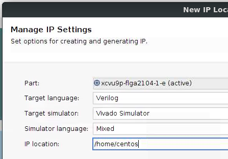
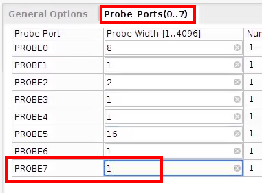

# Probing Vitis Design
This guide explains step-by-step how to probe a Vitis Design depending on the environment (OnPrem, AWS, ...)

## Table of Contents
1. Prerequisites
2. OnPrem Probing
3. AWS F1 Probing
4. Azure NP Probing

# 1. Prerequisites
Before being able to probe your design running on your destination board, you need to modify your design as follows:

# 1.1. Add ILA Core in the Design
You need first to generate the ILA Core to be added in your design.

* Start Vivado Tools and select "Manage IP" option and create a new IP location if you don't already have one.

* Configure the project with Part Name, Target Language, IP Location, ... and click "Finish"

* From the IP Catalog, enter "ILA" in the "Search" field and select the "ILA" core from the "Debug" section

* Customize the IP. The minimal changes to apply are: 
  * Change the number of Probes in the "General Options" tab:
  

  * For each probe, set the signal width (in bits):
  

* Once the configuration is done, click on "OK" and then click "Generate" in the "Generate Output Products" window that will appear.

After a few minutes, the ILA core files will be generated in the IP location you selected previously.

**Note**: Please make sure that the "Core Container" option  is disabled on your ILA IP.
If enabled, please disbale it, rest the output products and regenerate them.

For more detailed information, please refer to the [Xilinx Documentation](https://www.xilinx.com/support/documentation/sw_manuals/xilinx2019_2/ug936-vivado-tutorial-programming-debugging.pdf)

# 1.2.Update the Vitis project to add the ILA Core
* Copy the ILA core folder generated at the previous step in the source folder of you Vitis Design.
* Instantiate the ILA Core in your IP. You can find instantiation template in the ILA core folder (.veo or .vho).
* Update the IP tcl script to include the ILA core with the following line:

**read_ip [glob src/ila_0/ila_0.xci]**

**Note**: the folder name "ila_0" might be different in your case.

# 1.3. Run Synthesis
Run the synthesis proces as usual.

The newly generated XCLBIN file will contain the ILA core.

A ".ltx" file will also be generated. It contains the list of probes.

Both the XCLBIN and LTX files needs to be copied on the execution platform.

# 2. OnPrem Probing
## 2.1.  Prerequisite
  * Install Vivado Lab
  * Install XRT
  * Program the board with the XCLBIN file (or run the app once) 
  * [OPTIONAL] Edit the application software to add a breakpoint
## 2.2. Identify board driver file
In a terminal run the following command:
**ll /dev/xvc_pub\***

## 2.3. Start Xilinx Virtual Cable (XVC):
In a terminal run the following command:

**/tools/Xilinx/Vivado_Lab/{VERSION}/bin/xvc_pcie -d {BOARD_DRIVER_FILE}**

## 2.4. Start Hardware Server
In another termianl, run the following command:

**/tools/Xilinx/Vivado_Lab/{VERSION}/bin/hw_server -e "set auto-open-servers xilinx-xvc:localhost:10201" -e "set always-open-jtag 1"**

## 2.5. Start Vivado Lab GUI
**sudo /tools/Xilinx/Vivado_Lab/{VERSION}/bin/vivado_lab**

* Select "Open Hardware Manager"

* Select "Open target" then "Open New target" and use the following configuration:

  * Connect to: Local server
  * Select "Add Xilinx Virtual Cable (XVC)" and enter configuration:
    * Hostname=localhost
    * Port=10200
    

  * Select "Next" and then "Finish" .
  
You should see both your board and the debug bridge in the "hardware" window

* Select the debug bridge and in the "Hardware Device Properties" load the probes file (LTX)
* Configure the probes trigger

## 2.6. Run the software application
Run your software application to trigger the waveform capture.

## 2.7. [OPTIONAL] Export ILA Waveforms
In the Waveform window, select the icon "Export ILA waveform data"

**Note:** You can also use the TCL command:

**write_hw_ila_data {FILENAME}.ila [upload_hw_ila_data hw_ila_1]**

## 2.8. [OPTIONAL] Display Saved ILA Waveforms
To restore previously saved ILA waveform data, you can use the TCL command:

**display_hw_ila_data [read_hw_ila_data {FILENAME}.ila]**

# 3. AWS Probing
coming soon...
# 4. Azure NP Probing
coming soon...
