# Vitis RTL Kernel GUI Flow

In this Git Repository, we share mainly command-line based examples as we think users should always use command-line instead of GUI.

Indeed the GUI is more error-prone and GUI projects are much harder to maintain.

However, you might want to go against our recommendation and use the GUI flow anyway.
This guide explains step-by-step how to create a Vitis design with RTL kernel modules using both the Vivado and the Vitis GUI flows.

## Table of Contents
1. [Context](#1-context)
2. [Create and Package Kernels/IPs using Vivado](#2-create-and-package-kernelsips-using-vivado)
3. [Create and Package Kernels/IPs using Vitis](#3-create-and-package-kernelsips-using-vitis)
4. [Synthesize the FPGA Design using Vitis](#4-synthesize-the-fpga-design-using-vitis)

#-2.-Create-and-Package-Kernels/IPs-using-Vivado
#2-design-execution--debug

# 1. Context
In this guide, we've propose two ways for creating and packaging the vitis Kernels/IPs.

The Vivado flow targets advanced users. It provides more flexibility but also requires more manual steps.

The Vitis flow targets less experienced users. It provides a semi-automated flow but misses some advanced features.


# 2. Create and Package Kernels/IPs using Vivado
## 2.1. Project Creation
+ Open Vivado GUI and create a new project.
+ Select "RTL Project" and enable the "Do not specify sources at this time" checkbox
+ Select your targeted board

The Vivado GUI opens with your project.
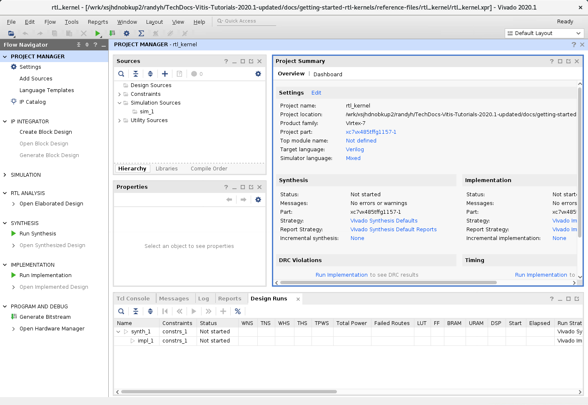

## 2.2. Add the Kernel Sources
As explained in the [Accelize Documentation](https://tech.accelize.com/documentation/stable/drm_hardware_integration.html), add the kernel and DRM sources files using the approriate Library names:
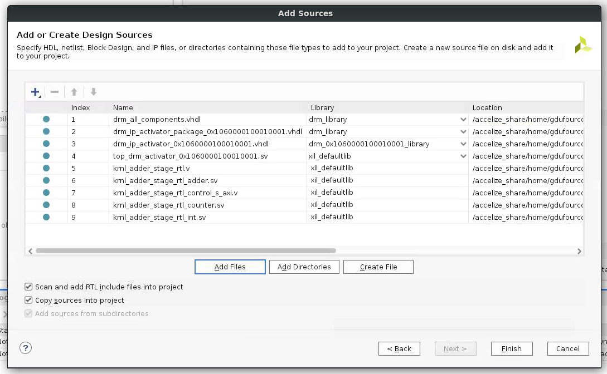
+ Select the "Copy sources into project" and "Add sources from subdirectories" checkboxes

## 2.3. Package the IP
+ Select Tools > Create and Package New IP
+ Select "Package your current project"
+ For IP location, take a look at the default location so you can see where your IP will be packaged. The specified location will be needed when running the **package_xo** command in a later step
+ Click on **Finish**

The Package IP wizard is displayed:
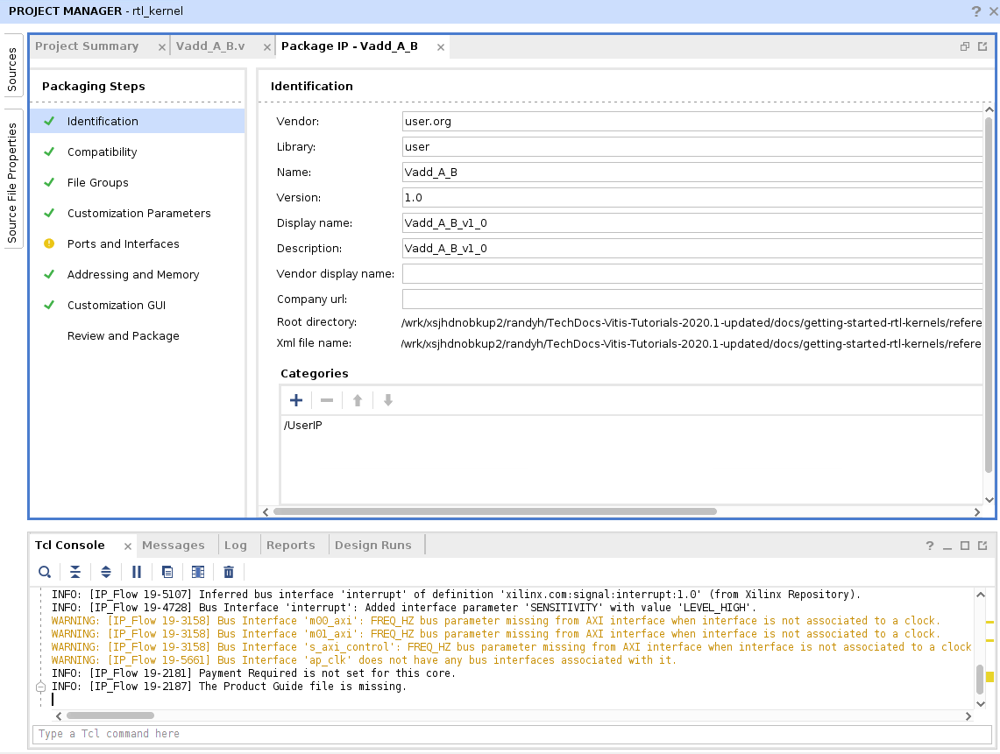

### 2.3.1. Compatibility section
Select the "Package for Vitis" checkbox and Control protocol "ap_ctrl_hs".
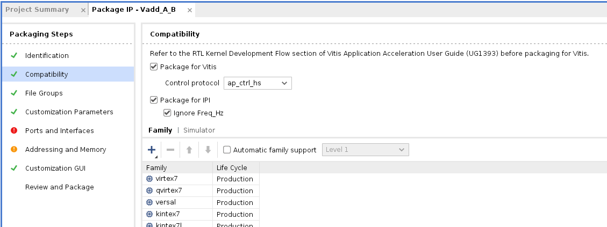

&#x26a0;&#xfe0f; Note: With Vivado versions prior to 2021.1, this checkbox and options will not be displayed. Instead, you'll have to enter a TCL command explained later.

### 2.3.2. Port and Interfaces section
Look for clock and reset signals that are not in the "Clock and reset Signals" folder.

One-by-one, change their type as follows:
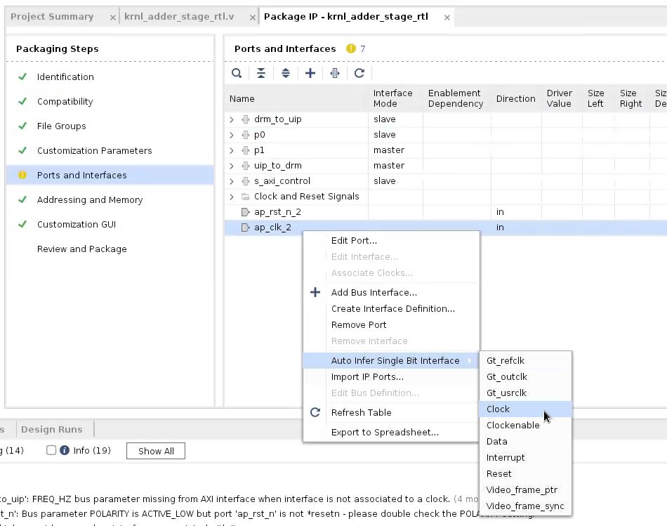
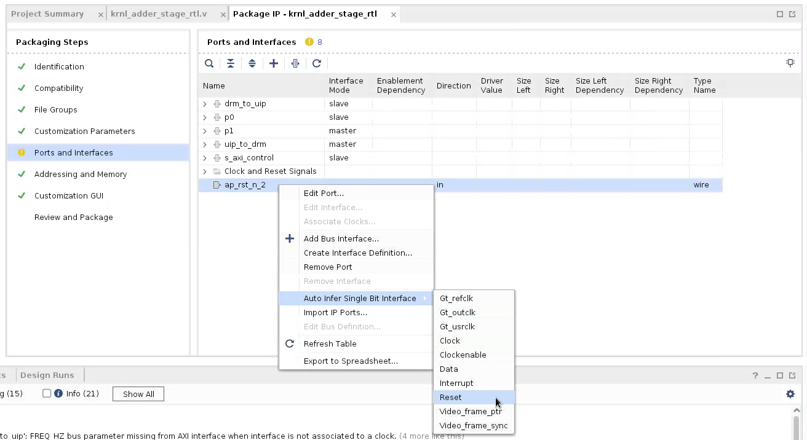

Then, if you use more than one clock, assign each port interface to its correct clock:
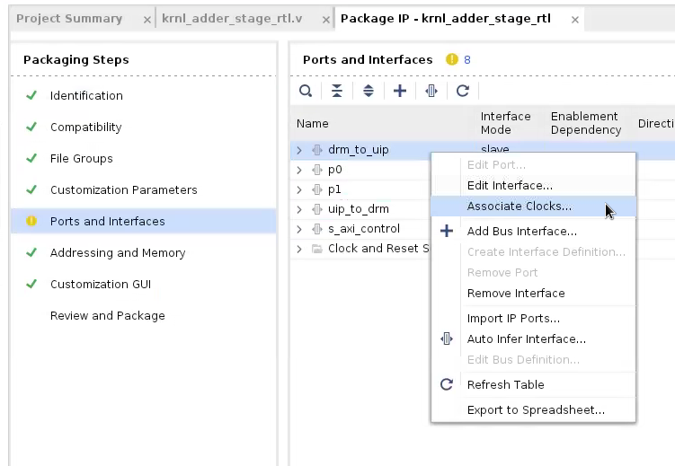
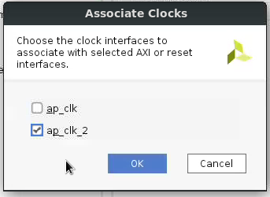

### 2.3.3. Addressing and Memory section
Add the registers needed for your application.

&#x26a0;&#xfe0f; Note: You must add a control register at address 0x0 to be compliant with the Vitis flow.

E.g: Adder Kernel Registers:

Name    | Description                       | Offset    | Size (bits)
--------|-----------------------------------|-----------|-----
CTRL    | Control Signals                   | 0x000     | 32
inc     | Scalar values                     | 0x010     | 32   
size    | Scalar values                     | 0x018     | 32

For kernels that requires AXI4 interface, you must:
1. Create a register
2. Right-click on it and slect "Add Register Parameter" 
3. The register parameter must be named "ASSOCIATED_BUSIF" 
4. The register parameter value must be set to the name of the AXI4 interface
5. The register parameter size must be identical to the size of the AXI4 interface

E.g: Input Kernel Registers:

Name    | Description                       | Offset    | Size (bits)
--------|-----------------------------------|-----------|-----
CTRL    | Control Signals                   | 0x000     | 32
input_r | Pointer                           | 0x010     | 64   
size    | Scalar values                     | 0x01C     | 32


### 2.3.4. Review and Package section
Click on "Package IP" and the ".xo" file will be generated in the IP location displayed before.

&#x26a0;&#xfe0f; Note: With Vivado versions prior to 2021.1, the .xo file is not generated.

To generate it, enter the following commands (after editing the paths and names) in the Vivado TCL console:

```bash
set_property sdx_kernel true [ipx::current_core]
set_property sdx_kernel_type rtl [ipx::current_core]

package_xo  -force -xo_path <project_path>/rtl_kernel/<kernel_name>.xo -kernel_name <kernel_name> -ip_directory <project_path>/rtl_kernel/rtl_kernel.srcs/sources_1/imports  -ctrl_protocol ap_ctrl_hs
```

# 3. Create and Package Kernels/IPs using Vitis
## 3.1. Project Creation
+ Open Vitis GUI and create a new application project.
+ Select "RTL Project" and enable the "Do not specify sources at this time" checkbox
+ Select your targeted board

The Vitis GUI opens with your project.
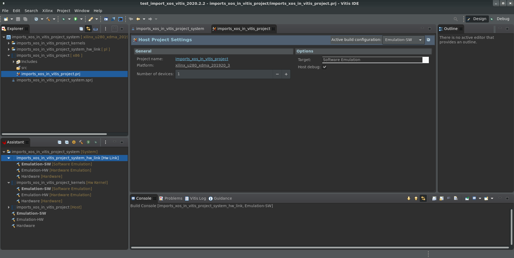

## 3.2. Create kernel using the RTL Kernel Wizard
Follow the steps described in the Xilinx Tutorial:

https://github.com/Xilinx/Vitis-Tutorials/blob/master/Hardware_Acceleration/Feature_Tutorials/01-rtl_kernel_workflow/vitis_ide.md

## 3.3. Update the kernel IP-XACT
After completing the RTL Kernel (Adding source file & Validate), Generate the .xo clicking on "Generate RTL Kernel"
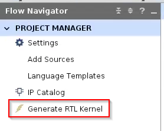

When prompted to exit Vivado, select "No"

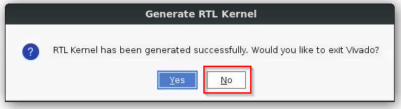

Then open the kernel IP-XACT file (component.xml)

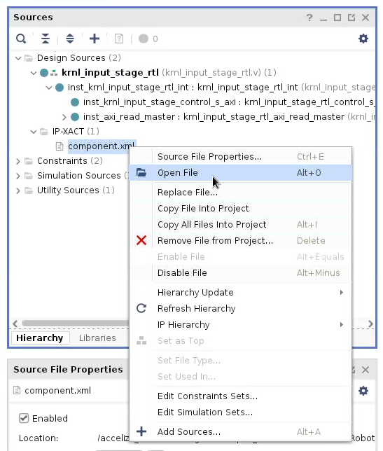

The Package IP wizard is displayed:


Follow the steps [2.3.1](#231-compatibility-section) to [2.3.4](#234-review-and-package-section)

&#x26a0;&#xfe0f; After updating the kernel IP-Xact **do not** click again on "Generate RTL Kernel"! as it will overwrite the configuration

&#x26a0;&#xfe0f; Please note that the newly generated xo file will not be imported automatically in the Vitis project when leaving Vivado. You need to remove the former one on import the new .xo file from folder ``` ${PROJECT_NAME}/vivado_rtl_kernel/${KERNEL_NAME}_ex/xo``` 

# 4. Synthesize the FPGA Design using Vitis
## 4.1. [OPTIONAL] Add other existing Kernels/IPs (xo packages)
+ Right-click on the 'src' folder in your project and select 'Import Sources'
+ Browse you filesystem and select the xo packages
+ Click on 'Finish'

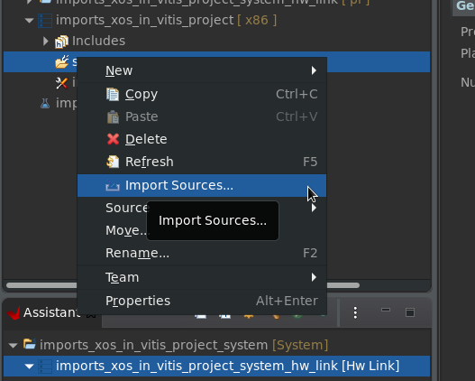
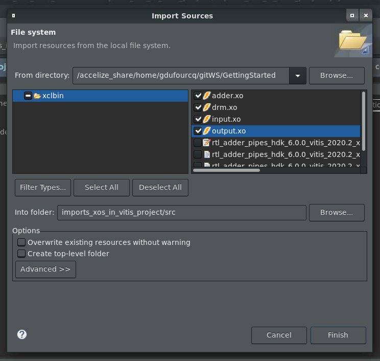
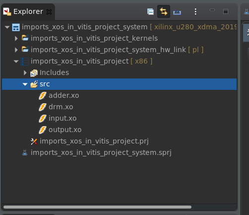

## 4.2. Configure the FPGA Design Settings
+ Create/Import a configuration file in '<PROJECT_NAME>_kernels/Hardware' folder
+ Edit the content as required by your project (kernel frequencies, stream interconnect, ...)
E.g:
```bash
kernel_frequency=0:100|1:100

[connectivity]
stream_connect=krnl_input_stage_rtl_1.p0:krnl_adder_stage_rtl_1.p0
stream_connect=krnl_adder_stage_rtl_1.p1:krnl_output_stage_rtl_1.p1
stream_connect=kernel_drm_controller_1.drm_to_uip0:krnl_adder_stage_rtl_1.drm_to_uip
stream_connect=krnl_adder_stage_rtl_1.uip_to_drm:kernel_drm_controller_1.uip0_to_drm
```
+ Configure the toolchain to use this configuration file
  + Add a binary container by righ-clicking on the Assistant > <PRJ_NAME> > <PRJ_NAME>_hw_link > Hardware entry and chossing 'Add Binary Container'
  + Right-click on the binary container and select 'Settings'
  + Add '--config <PATH_TO_YOUR_CONFIG_FILE>' in th efield 'V++ linker options'
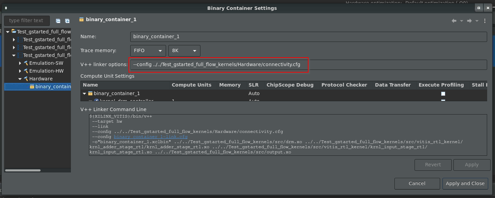
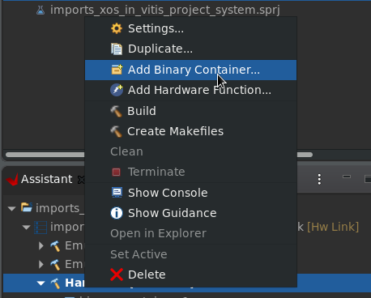

## 4.2. Add Hardware Functions to the Binary Container
+ Right-click on the Binary Container and select 'Add Hardware Function ...'
+ Select every Kernels/IPs needed for your design and click 'OK'
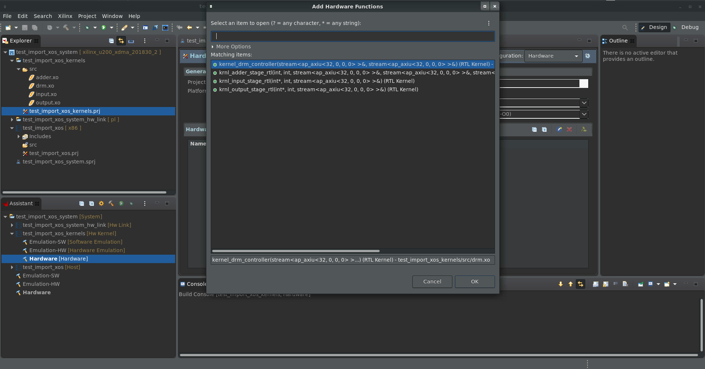

&#x26a0;&#xfe0f; Note: If the 'Hardware Functions' menu is empty, you can try to run a first synthesis (next steps) and wait a few minutes before retrying

## 4.3. Run Synthesis
+ Select 'Hardware' as the active build configuration
+ Click on 'Build' (Hammer icon)

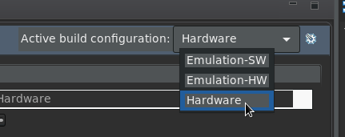

## References
This guide is mostly based on the Vitis 2021.1 tutorial "RTL Kernel Workflow":

https://github.com/Xilinx/Vitis-Tutorials/blob/master/Hardware_Acceleration/Feature_Tutorials/01-rtl_kernel_workflow/README.md
